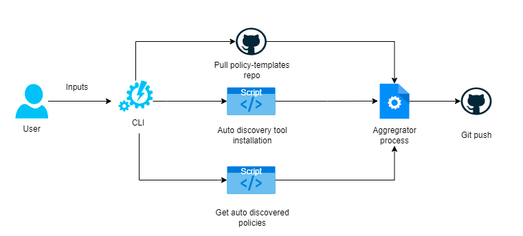
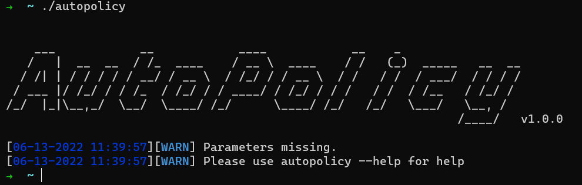
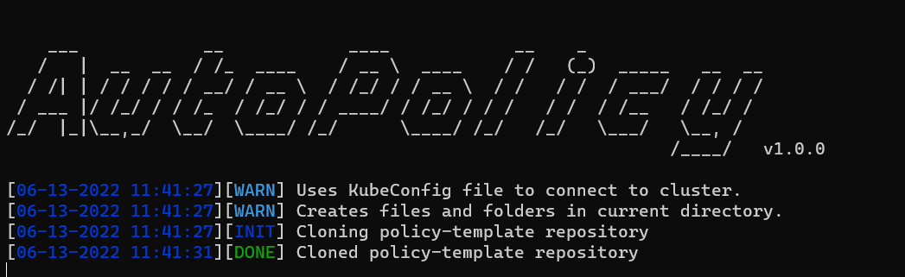
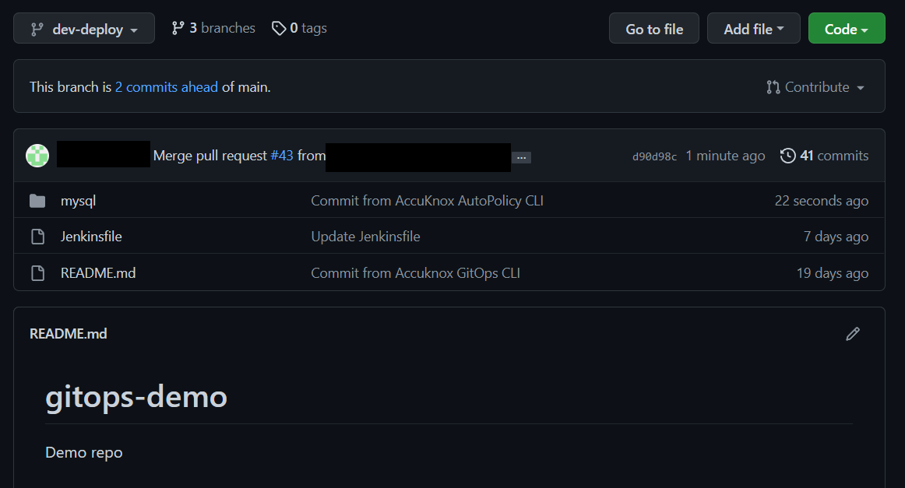
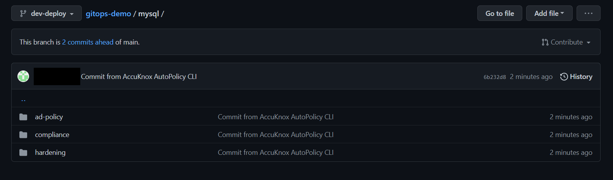

AutoPolicy
---

AutoPolicy is used to create YAML-based runtime security policies which can be enforceable by [AccuKnox](https://www.accuknox.com/) opensource tools. AutoPolicy offers auto-discovered policies based on the workloads as well as policies that are tailored for specific use cases.
We have a [dedicated repository](https://github.com/kubearmor/policy-templates) that houses various types of policies specific to CVEs, Workloads, Malware, and many more. 


## Prerequisites

To make the tool work you need to have
 - a Kubernetes cluster 
 - a configured kubectl binary 
 - go version >= 1.17.8

## How it works
The architecture is pretty straightforward. 
<h3 align="center">
  </a>
</h3>


The CLI takes in some inputs from the user and starts its action by connecting to the Kubernetes Cluster and checking for deployed workloads. Once these are identified the CLI pulls down the policy-templates repository and creates separate policy files with updated labels and namespace so that these policies are ready to be enforced on the cluster.

<h3 align="center">
  </a>
</h3>

</br>

<h3 align="center">
  </a>
</h3>

</br>

### Final Output in GitHub

 <h3 align="center">
   </a>
 </h3>

</br>

 <h3 align="center">
   </a>
 </h3>

## Install AutoPolicy

AutoPolicy requires  **go1.17 or higher**  to install successfully. Run the following commands to build the latest version-
```sh
git clone git@github.com:accuknox/autopolicy.git
cd autopolicy
go build -o autopolicy
```
To run the program use-
```sh
./autopolicy
```


### Usage

```sh
autopolicy -h
```

This will display help for the tool. Here are all the switches it supports.


```console
NAME:
   Auto Policy - A simple CLI tool automates the creation of YAML-based runtime network & system security policies on top of Auto-Discovery feature by AccuKnox and Policy Templates

USAGE:
   autopolicy [Flags]

   1. Generate policies locally    -->  autopolicy --generate-locally --action=Audit --exclude-ns=kube-system
   2. Generate and push to GitHub  -->  autopolicy --git_base_branch=deploy-branch --git-branch-name=temp-branch --git-token=gh-token123 --git-repo-url= https://github.com/testuser/demo.git --git-username=testuser

VERSION:
   1.0.0

COMMANDS:
   help, h  Shows a list of commands or help for one command

GLOBAL OPTIONS:
   --action-value value, --action value           Action value for policy. Can be Audit, Block, Allow or no-change (default: Audit)
   --auto-apply, --auto                           If true, modifed YAML will be applied to the cluster (default: false)
   --exclude-namespace value, --exclude-ns value  Option to exclude generation of policies on certain namespaces
   --generate-locally, --gen-loc                  If true, Policy YAML will only be generate locally under $(pwd)/accuknox-client-repo/ (default: false)
   --git-base-branch value, --basebranch value    GitHub base branch name for PR creation
   --git-branch-name value, --branch value        GitHub branch name for pushing updates
   --git-repo-url value, --git-url value          GitHub URL to push the updates
   --git-token value, --token value               GitHub token for authentication
   --git-username value, --git-user value         GitHub username
   --help, -h                                     show help (default: false)
   --only-on-namespace value, --only-on-ns value  Option to generation of policies only on certain namespaces
   --version, -v                                  print the version (default: false)
```

### Running AutoPolicy

1. Generate policies locally
```sh
autopolicy --generate-locally --action=Audit --exclude-ns=kube-system
```
2. Generate and push to GitHub 
```sh
autopolicy --git_base_branch=deploy-branch --git-branch-name=temp-branch --git-token=gh-token123 --git-repo-url= https://github.com/testuser/demo.git --git-username=testuser --only-on-ns default
```

### Resources

- [AccuKnox opensource quick start guide](https://help.accuknox.com/open-source/quick_start_guide/) 
- [What is policy discovery?](https://help.accuknox.com/getting-started/policy-discovery/)
- [KubeArmor: Runtime protection for Kubernetes & other cloud Workloads ](https://kubearmor.io/) 
- [What is Cilium?](https://help.accuknox.com/open-source/what-is-cilium/) 
